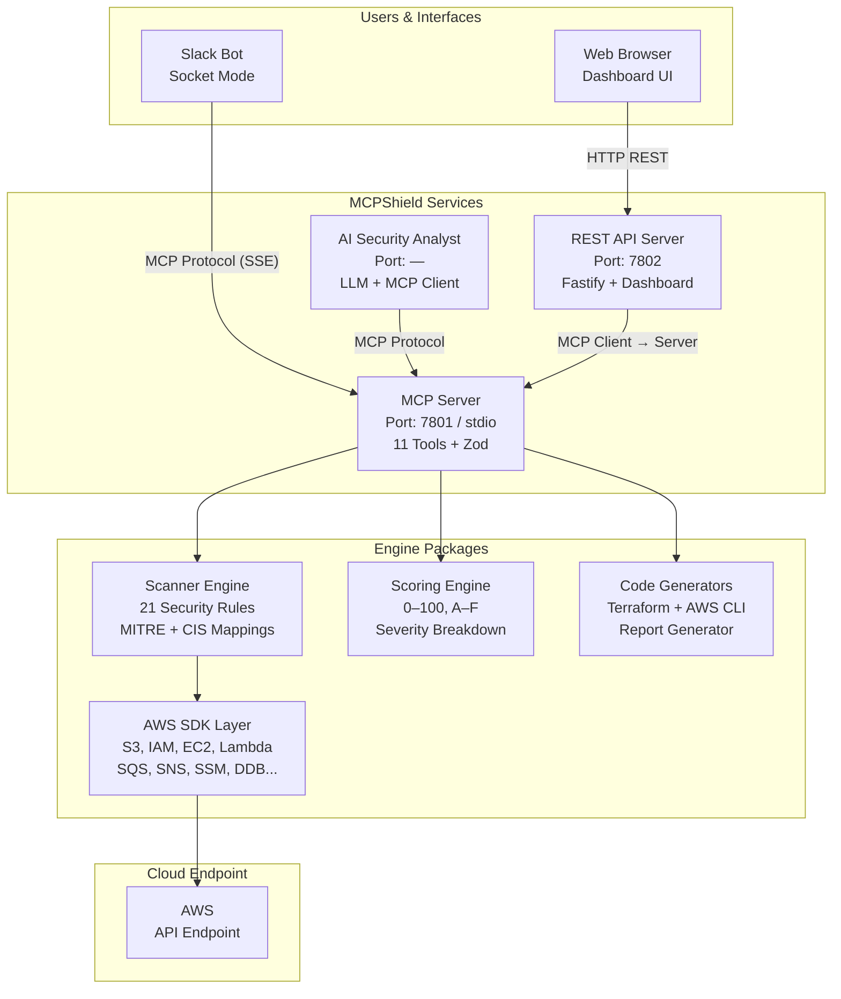
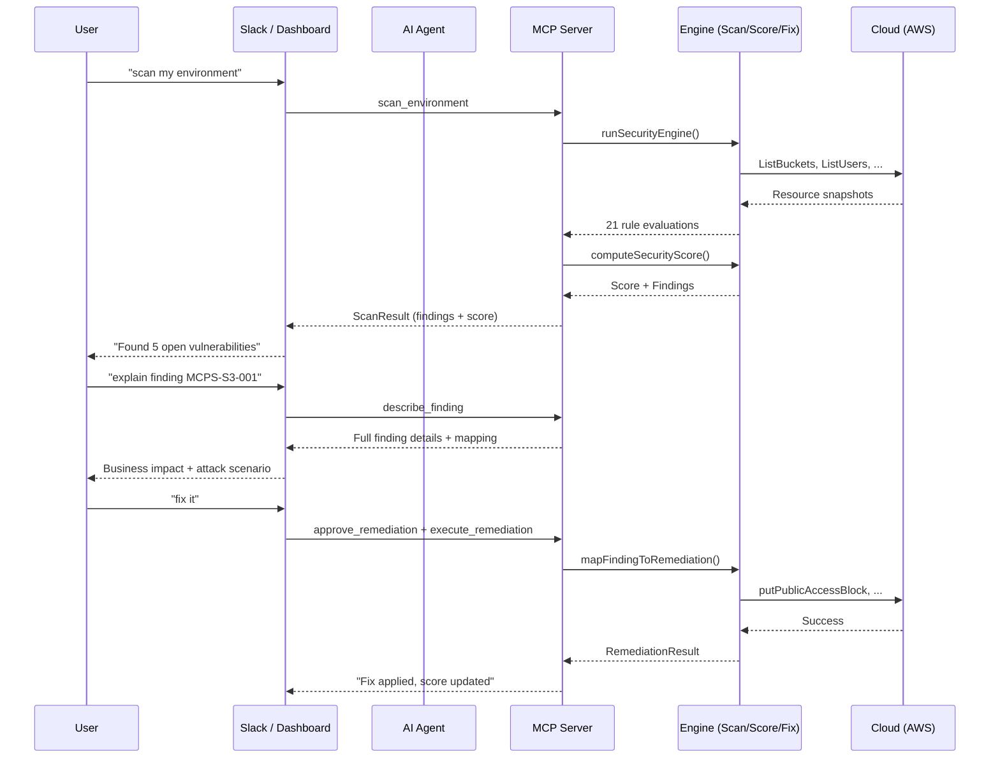
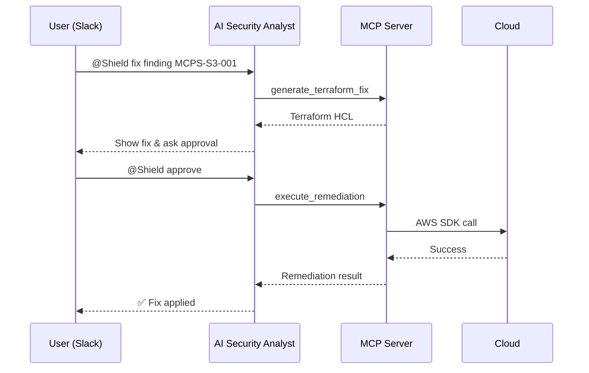
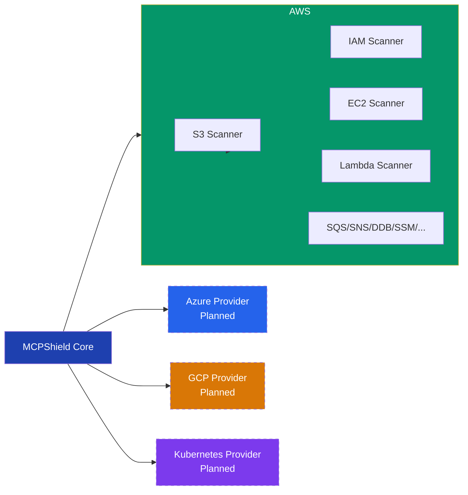

# MCPShield

> **An AI-Powered Cloud Security Posture Management (CSPM) tool using the Model Context Protocol (MCP)**

MCPShield uses AI agents to scan cloud environments, detect security misconfigurations, generate Terraform and CLI remediations, and enforce human-in-the-loop approval workflows.

---

## Features

- **21 Cloud Security Rules** — Critical, High, Medium, and Low findings with MITRE ATT&CK and CIS Benchmark mappings
- **AI Security Analyst** — Slack-integrated agent that explains findings, prioritizes risk, and guides remediation
- **Terraform Remediation** — Auto-generated HCL for every finding
- **AWS CLI Remediation** — Auto-generated CLI commands for every finding
- **Human-in-the-Loop** — No write operations execute without explicit approval
- **Executive Reports** — Professional security posture assessment reports (Markdown)
- **Security Scoring** — 0–100 score with A–F letter grade and severity breakdown
- **Multiple LLM Providers** — NVIDIA NIM, Gemini, Ollama, OpenAI-compatible
- **Web Dashboard** — Real-time security posture visualization
- **Cloud-Agnostic Architecture** — Provider interface ready for AWS, Azure, GCP, and more

---

## Architecture

### System Topology



**Key:** The AI agent NEVER communicates directly with the cloud. Every read/write operation goes through MCP tools.

### Data Flow



### Approval Workflow



### Provider Architecture



Currently ships with the **AWS provider** only. Additional providers are on the roadmap.

---

## Tech Stack

| Layer | Technology |
|---|---|
| Runtime | Node.js 22+, TypeScript |
| Package Manager | pnpm workspaces |
| MCP SDK | @modelcontextprotocol/sdk |
| AI Providers | NVIDIA NIM, Gemini, Ollama, OpenAI-compatible |
| Cloud SDK | AWS SDK v3 |
| HTTP | Fastify |
| Validation | Zod |
| Logging | Pino |
| Slack | @slack/bolt (Socket Mode) |
| Testing | Vitest |
| Linting | ESLint + Prettier |

---

## Project Structure

```
mcpshield/
├── apps/
│   ├── agent/           # Slack bot + LLM integration
│   ├── api/             # REST API (dashboard backend)
│   ├── dashboard/       # Web dashboard SPA
│   └── mcp-server/      # MCP tool server
├── packages/
│   ├── aws-tools/       # AWS SDK clients, scanner, remediator
│   ├── security-engine/ # Security rule evaluation (21 rules)
│   ├── finding-engine/  # Finding catalog and registry
│   ├── scoring-engine/  # Security score calculator (0–100, A–F)
│   ├── terraform-generator/  # HCL code generator
│   ├── aws-cli-generator/    # CLI command generator
│   ├── report-generator/     # Executive report generator
│   ├── llm/             # Shared LLM provider adapters
│   ├── types/           # Shared Zod schemas and types
│   ├── shared/          # Utility functions
│   ├── logger/          # Pino logger wrapper
│   └── config/          # Environment config loader
├── docs/                # Documentation
├── labs/                # Workshop labs
├── docker/              # Dockerfiles
└── docker-compose.yml   # Service orchestration
```

---

## Quick Start

### Prerequisites

- Node.js >= 22
- pnpm >= 9
- An AWS-compatible endpoint (see below)

### Setup

```bash
# Clone
git clone https://github.com/akintunero/mcpshield.git
cd mcpshield

# Install dependencies
pnpm install

# Configure environment
cp .env.example .env
# Edit .env — at minimum set LLM_PROVIDER and your API key
```

### Run

Start the MCP server and API (development mode with hot reload):

```bash
# Terminal 1 — MCP Server (port 7801)
pnpm --filter @mcpshield/mcp-server dev

# Terminal 2 — REST API + Dashboard (port 7802)
pnpm --filter @mcpshield/api dev
```

Or use Docker for all services:

```bash
docker compose up --build
```

### Cloud Endpoint

Configure your AWS endpoint via `.env`:
```
LOCALSTACK_ENDPOINT=http://localhost:4566
AWS_ACCESS_KEY_ID=test
AWS_SECRET_ACCESS_KEY=test
AWS_DEFAULT_REGION=us-east-1
```

---

## Usage (Slack)

```
@Shield scan environment
@Shield show findings
@Shield explain finding MCPS-S3-001:vulnerable-bucket
@Shield generate terraform finding MCPS-S3-001:vulnerable-bucket
@Shield fix finding MCPS-S3-001:vulnerable-bucket
@Shield approve
@Shield rescan
@Shield security score
@Shield generate report
```

Or open the web dashboard at `http://localhost:7802`.

---

## Security Findings (21 Rules)

| Severity | Count | Examples |
|---|---|---|
| Critical | 3 | Public S3 bucket, Admin access on user, Old access keys |
| High | 7 | SSH open to internet, RDP open, Missing encryption, No versioning, CloudTrail disabled, Unencrypted SSM parameter |
| Medium | 8 | Weak password policy, Unused user, Unused keys, No bucket logging, Lambda deprecated runtime, SQS/SNS/DDB/Secrets missing encryption |
| Low | 3 | Missing tags, Poor naming, Missing descriptions |

Every finding includes: Unique ID, Severity, Description, Business Impact, Technical Impact, Attack Scenario, Best Practice, MITRE ATT&CK mapping, CIS mapping, Terraform remediation, AWS CLI remediation, and Risk Score.

---

## Documentation

- [Installation Guide](docs/installation.md)
- [MCP Server Reference](docs/mcp.md)
- [AI Agent Guide](docs/agent.md)
- [Security Engine](docs/security-engine.md)
- [Finding Engine](docs/finding-engine.md)
- [Slack Integration](docs/slack.md)
- [Roadmap](docs/roadmap.md)

## Contributing

Contributions welcome! See the [Roadmap](docs/roadmap.md) for planned features. Please open an issue first to discuss changes.

## License

MIT — see [LICENSE](LICENSE)


