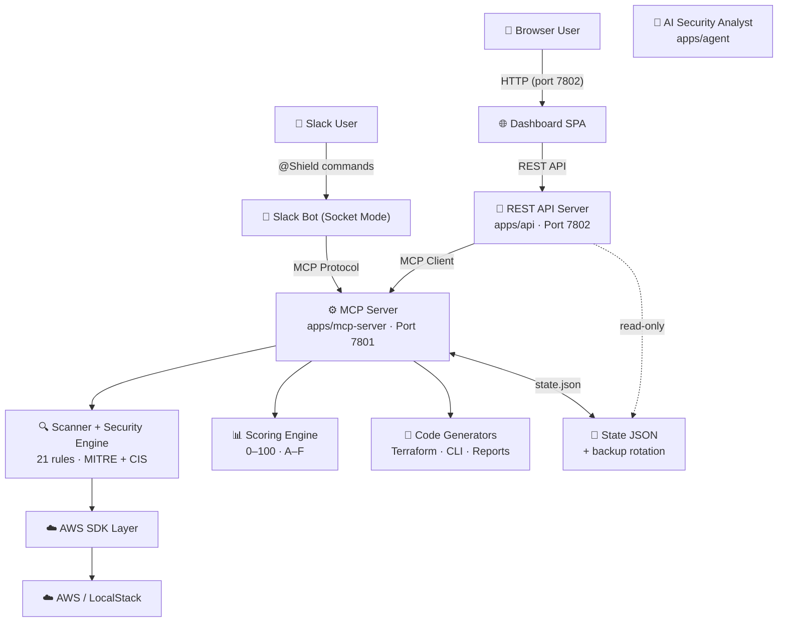

# MCPShield System Architecture

## 1. System Topology

MCPShield is a TypeScript monorepo with decoupled packages and independent application nodes.



> **Security Boundary:** The AI agent NEVER communicates directly with the cloud. All operations go through MCP tools with human-in-the-loop approval for writes.

## 2. Production Features

| Feature | Implementation |
|---------|---------------|
| **API Auth** | Bearer token via `API_KEY` env var. Optional — disabled when unset (dev mode) |
| **Rate Limiting** | `@fastify/rate-limit` — configurable via `RATE_LIMIT_MAX` (default 100/min) |
| **TLS/SSL** | Optional via `TLS_KEY_PATH` + `TLS_CERT_PATH` |
| **Metrics** | Prometheus-style `/metrics` endpoint (requests, errors, uptime) |
| **Graceful Shutdown** | SIGTERM/SIGINT handlers close servers cleanly |
| **State Backups** | Rotating backups of `state.json` (configurable count) |

## 3. Dashboard Layout

The dashboard is a 3-column SPA:

```
┌────────┬──────────────────┬──────────────────┐
│ Posture│   Findings       │   Remediation    │
│ Score  │   Inventory      │   Hub            │
│        │                  │                  │
│ Ring   │ 🔴 Critical (2) │ Description      │
│ Grade  │ 🟠 High   (4)   │ Technical Impact │
│        │ 🟡 Medium (3)   │ Attack Scenario  │
│ Bars   │ 🔵 Low    (5)   │ ┌─┬─┬─┐          │
│        │                 │ │D│T│C│  Tabs    │
│        │                 │ └─┴─┴─┘          │
└────────┴──────────────────┴──────────────────┘

💬 Floating Chat (bottom-right corner)
```

- **Posture Card** — Score ring, letter grade, severity bar graph, scan metadata
- **Findings List** — Filterable by severity, click to select
- **Remediation Hub** — Detail view with tabs (Description, Terraform Fix, AWS CLI Fix)
- **Chat Widget** — Floating button, popup overlay, AI analyst conversation

## 4. Human-in-the-Loop Security Boundaries

1. **Separation of Scan and Fix** — Scanning is read-only
2. **Approval Registry** — Remediation creates a pending approval record. Does NOT mutate AWS
3. **Explicit Token Execution** — Mutations happen only with a valid `approvalId`
4. **Audit Log** — Every remediation is logged with approver identity and timestamp

## 5. MCP Tools Catalog

| Tool | Params | Purpose |
|------|--------|---------|
| `scan_environment` | `services?` | Scan AWS services for misconfigurations |
| `list_findings` | `severity?`, `service?` | List detected findings |
| `describe_finding` | `findingId` | Full finding details with MITRE/CIS mapping |
| `generate_terraform_fix` | `findingId` | Generate Terraform HCL remediation |
| `generate_cli_fix` | `findingId` | Generate AWS CLI remediation |
| `approve_remediation` | `findingIds`, `approvedBy` | Create approval for fixes |
| `execute_remediation` | `approvalId` | Apply approved fixes to cloud |
| `rescan_environment` | – | Re-scan after remediation |
| `security_score` | – | Compute current posture score (0–100) |
| `generate_report` | – | Generate executive Markdown report |
| `health` | – | Server + cloud connectivity check |

## 6. State Persistence

State is stored as JSON with automatic backup rotation:

```
.mcpshield-state/
├── state.json              # Current state
├── state-2026-07-20T10-00-00-000Z.bak  # Backup 1
├── state-2026-07-20T09-55-00-000Z.bak  # Backup 2
└── ...
```

The API reads state **read-only**. The MCP server owns writes. This prevents file collision.
