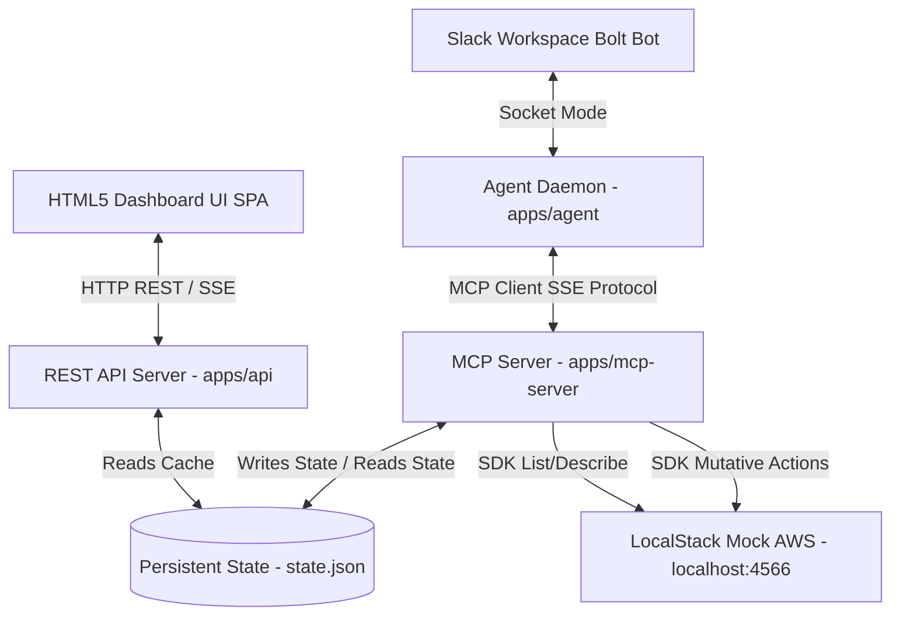

# MCPShield System Architecture Log

This document provides a comprehensive analysis of the architectural design, directory mappings, communication flow, and security design boundaries of MCPShield.

---

## 1. System Topology Overview

MCPShield is structured as a TypeScript monorepo containing decoupled packages (core logic layers) and independent application nodes (runtimes).

The following Mermaid diagram visualizes the communication paths and runtime topology:



---

## 2. Directory Structure Mappings

```text
mcpshield/
├── apps/
│   ├── agent/                 # Slack Socket Mode Bot Agent
│   ├── api/                   # REST API Server serving dashboard static assets
│   ├── dashboard/             # Pure SPA Dashboard Source (dist/ holds served SPA)
│   └── mcp-server/            # Fastify SSE & Stdio Model Context Protocol Server
├── packages/
│   ├── aws-tools/             # SDK client instantiations & raw resource scanner
│   ├── security-engine/       # Rule compliance checker evaluating raw snapshots
│   ├── scoring-engine/        # Security score and grade calculator
│   ├── terraform-generator/   # Terraform catalog fixing block compilations
│   ├── aws-cli-generator/     # AWS CLI catalog command compilation
│   ├── report-generator/      # Executive markdown report formatting
│   ├── types/                 # Shared domain types
│   ├── shared/                # Core utilities (shortId, nowIso)
│   ├── logger/                # Pino logger wrapper
│   └── config/                # Environment variable schemas & loaders
├── scripts/
│   ├── bootstrap.sh           # macOS & Linux bootstrap check & provisioning launcher
│   ├── bootstrap.ps1          # Windows PowerShell bootstrap check & provisioning launcher
│   └── provision.ts           # Indempotent AWS target environment provisioning
└── docker-compose.yml         # Container orchestration system
```

---

## 3. Human-In-The-Loop Security Boundaries

A primary design constraint of MCPShield is enforcing strict **least-privilege operations**:
1. **Separation of Scan and Fix:** The scanning process is passive and completely read-only.
2. **Approval Registry:** When a remediation action is triggered (e.g. `@Shield fix finding <id>`), the MCP server compiles the fix and creates a pending approval record in the state JSON. It does NOT mutate the AWS environment.
3. **Explicit Token Execution:** An environment mutation occurs ONLY when a client issues an `execute_remediation` tool call containing a valid `approvalId` that corresponds to an approved registry record.
4. **Local Audit Log:** Every executed remediation updates the score and registers an entry in the persistent remediation result audit log, which is rendered dynamically in the dashboard.

---

## 4. MCP Tools Catalog Reference

The MCP Server exposes the following standard tool methods:

| Tool Name | Parameters Schema | Returns | Purpose |
|---|---|---|---|
| `scan_environment` | `services?: AwsService[]` | `ScanResult` | Queries AWS APIs and runs rule validations. |
| `list_findings` | `severity?: Severity` | `ListFindingsResult` | Retrieves open findings from cache. |
| `describe_finding` | `findingId: string` | `FindingDetail` | Returns deep finding schema & rules metadata. |
| `generate_terraform_fix`| `findingId: string` | `FixResponse` | Compiles HCL block to remediate finding. |
| `generate_cli_fix` | `findingId: string` | `FixResponse` | Compiles shell command to remediate finding. |
| `approve_remediation` | `findingIds: string[]`, `approvedBy: string`, `note?: string` | `Approval` | Registers an authorization record. |
| `execute_remediation` | `approvalId: string` | `RemediationRunResult` | Applies mutative SDK remediations. |
| `rescan_environment` | - | `ScanResult` | Performs delta check to confirm resolutions. |
| `security_score` | - | `ScoreResult` | Returns current letter grade & percentage. |
| `generate_report` | - | `ReportResult` | Compiles Executive Summary Markdown. |
| `health` | - | `HealthResponse` | Evaluates LocalStack connectivity & server stats. |
